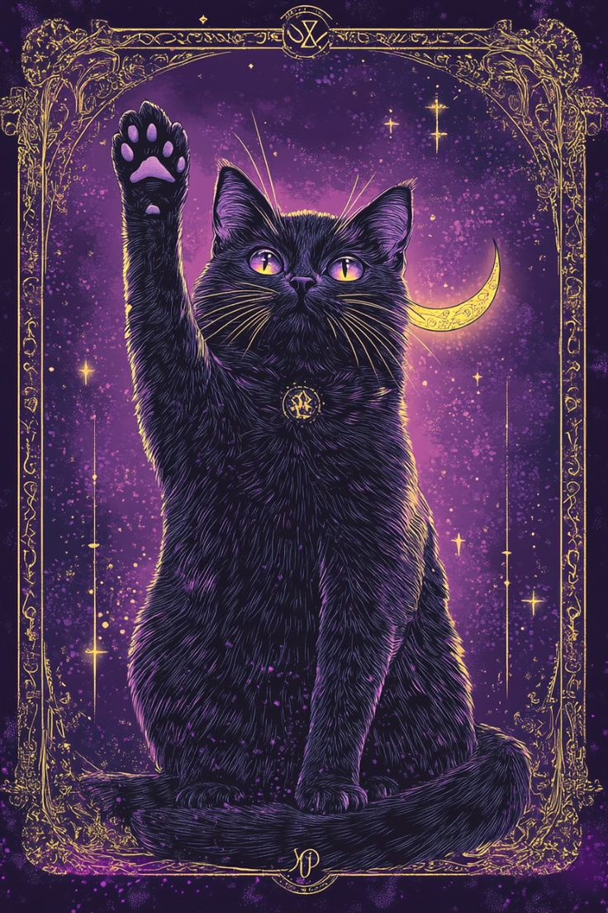

  

<h1 align="center">🐈‍⬛✨ Bienvenid@ al Grimorio de los Gatos Brujos ✨🐾</h1>

  <em>Entre hechizos de código y maullidos de inspiración, aquí se invocan proyectos con magia y método.</em>

  

  

## 🌙 Quién soy

Soy una artesana del software que mezcla **hechicería tecnológica** con ternura felina. Me mueven tres cosas:  
1) crear experiencias útiles y bonitas,  
2) escribir código que otras personas disfruten leer, y  
3) aprender con curiosidad obsesiva (como gato frente a una caja nueva 🐾).

En mi coven de desarrollo, cada commit es un conjuro para mejorar la vida de alguien: un flujo más claro, una interfaz que respira, un backend que jamás te abandona a medianoche. Si algo me define es la **combinación de diseño + ingeniería + empatía**: pienso en usuarios, datos y equipo a la vez.

**Mi misión**
- ✨ Convertir problemas complejos en soluciones **claras, accesibles y escalables**.  
- 🔮 Diseñar sistemas que se **explican solos**: nombres precisos, arquitecturas limpias, docs al día.  
- 🧪 Aprender y compartir: **experimentos**, post-mortems, componentes reutilizables, patrones de diseño.

**Mantras de código (reglas del coven)**
- “Primero la **legibilidad**; la optimización llega como gato: sigilosa y en el momento justo.”  
- “Si algo no está documentado, es magia negra.”  
- “Un buen componente **se explica en su API**, no en un tutorial de 20 pasos.”  
- “Tests que cubren casos reales > métricas vacías.”  
- “Cada ‘no’ a scope creep es un **sí** a la calidad.”

**Cómo me gusta colaborar**
- Conversaciones francas, feedback rápido y tableros vivos (issues claras, PRs pequeños).  
- Roadmaps con **prioridades visibles**, decisiones registradas y artefactos compartidos (Storybook/Docs).  
- Entornos donde el “¿por qué?” es tan importante como el “¿cómo?”.

Si te resuena construir productos con una pizca de magia y mucho método, pasa al **Portal del Aquelarre** al final del README y charlamos.  
 

  

## 🐾 Herramientas del Aquelarre

  

- ⚡ **Lenguajes mágicos**: JavaScript · TypeScript · PHP · Python  
- 🌑 **Hechizos poderosos**: React · Laravel · Next.js · Node.js  
- 📖 **Grimorios de datos**: MySQL · PostgreSQL · MongoDB  
- 🪄 **Artes adicionales**: TailwindCSS · HeroUI · Docker · Git

  
  
  
  
  
  
  
  

 

  

## 🐈‍⬛ Proyectos en Invocación
- 🤖 **IA & Chatbots** como familiares digitales.  
- 🪄 **Aplicaciones web** encantadas con **Laravel + React**.  

  

## 🔮 Estadísticas del Grimorio

  

  

## 🌌 Portales del Aquelarre
- 🐾 <a href="https://linktr.ee/cecydesy?utm_source=linktree_admin_share">Linktree</a>  
- 🐾 <a href="https://www.linkedin.com/in/cecilia-desiree-516969297">LinkedIn</a>

---

  <i>🐈‍⬛✨ Que tus commits sean conjuros y tus repositorios grimorios ✨🐾</i>

